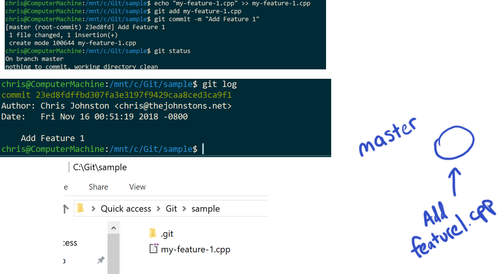

# Branching and Merging

Branching is an action that is used in Git to maintain multiple versions of a codebase at the same time.
A common way that it's used is to maintain a "stable" version of the codebase, typically in `master`,
and work on new features in their own branches.
This is nice to have, for example if you are working on functionality that may be breaking, you can
maintain a backed-up copy of working code in case something goes wrong, but without the need to have
commented-out code.

As long as you don't have uncommitted changes, Git will let you switch branches at anytime. This is called
"checking out" a branch.

## Example of Branches in Use

A great way to see how branches work is to visualize it.



In this example, I have a repo that contains the file `my-feature-1.cpp`, which I added in a single commit `23ed8f` (tip: you can refer to commits by the first 5 characters of the hash).
This commit was added on the `master` branch.

Now suppose I want to add a new file, but I want to preserve a working copy of the application.

Using the command `git checkout -b feature-2`, I can create a new branch named `feature-2` from the current commit.

On this new branch, I can add the `my-feature-2.cpp` file, and commit it to the `feature-2` branch.
Using the `git log`, I can see both of my commits.


And if I look at the files that are contained in this directory, both are there.


Git maintains a reference to the currently checked-out commit. At any time, we can change which commit we want to use, and get a different version of the
repository, all without losing any changes.

Using the `git checkout master` command, we can go back to the `master` branch. Because our commit that added the `my-feature-2.cpp` file happened
on `feature-2` and not `master`, we won't see this file.


And Git allows for simultaneous development on multiple branches, so you can even make commits on this branch.


Now, if we look at the contents of each branch:


Suppose that we are done working on the `feature-2` branch, and want to add it to our stable branch `master`.
Using the following commands, we can add the commits from the `feature-2` branch into the `master` branch.

```console
git checkout master # where we want to merge into
git merge feature-2 # copy commits from this branch into active branch
```

Now, our repo will look like this:


All of the commits and files from either branch are contained in the `master` branch.

Now, sometimes issues may arise when multiple changes are made to the same set of files.
This results in merge conflicts, because Git is unable to automatically merge the two files.
The solution to this is to manually merge the two files together, which can be a time-consuming process.
[This guide briefly explains how to resolve merge conflicts.](https://help.github.com/articles/resolving-a-merge-conflict-using-the-command-line/)

## Checking out a new branch

To create a new branch from your current branch, run the following command:

```console
git checkout -b NEW_BRANCH_NAME_GOES_HERE
```

You can verify that you have created and switched to the new branch by running `git status`.

## Switch to an existing branch

To switch to an existing branch that's different from your current branch, run the following command:

```console
git checkout BRANCH_NAME_TO_SWITCH_TO_GOES_HERE
```

**NOTE** If you have uncommitted changes, those changes will be carried over into the branch you switch to.

## Pushing the current branch to GitHub

After setting the remote URL, you can push your current branch (if you have write-access to the GitHub repository you're hoping to push to) to GitHub by running:

```console
git push -u origin BRANCH_NAME_GOES_HERE
```

You can verify if this command worked by navigating to your repository's webpage. You should see your branch listed in the branch list.

**NOTE** If you want to push new commits to the GitHub repository after you have ran the above command, run `git push`.

## Merging branches

In order to merge branches simply run the following command:

```console
git merge BRANCH_NAME_TO_MERGE_WITH_GOES_HERE
```

This will merge the branch specified into the current branch.

**NOTE** You might run into merge conflicts if two different commits from the base and merging branch change the same line in the same file. We will not be covering how to deal with merge conflicts in this tutorial.

[Learn more about how to resolve merge conflicts here](https://help.github.com/articles/resolving-a-merge-conflict-using-the-command-line/).