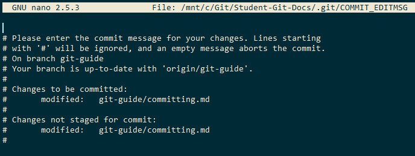
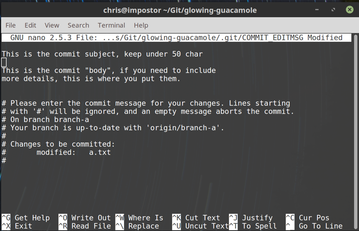
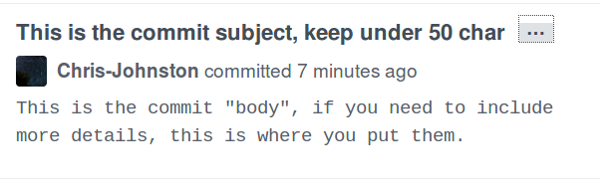

# Committing Changes

In Git, committing is the action of storing changes in the staging area, and adding them to the repo.

## How to Commit

Once files are staged for commit (you can check with `git status`), the command `git commit` will let you store
these changes into a single commit.

Simply type `git commit`, and your text editor will open:



Git commits have the following structure:

```
First line is a brief description, less than 50 chars

(optional) Extended description after a new line. 
This can be longer than 50 characters.
```
Lines that start with `#` are ignored.

When you are done writing your commit message, simply save your changes and exit the editor.
In Nano, you do this by pressing `CTRL + X`.

If you wish to cancel a commit, you can exit the editor without saving any message, or by saving a blank message.

It's important to follow this structure for commit messages, since that's what is assumed by tools and websites, including GitHub.



And the same commit, as seen in GitHub:



### Commit Message Editors

By default, `git commit` uses Vim as the default command-line commit message editor.
For the unexperienced, Vim can be notoriously difficult to use without instruction.
[This has resulted in "How to exit the Vim editor?" becoming the most viewed question on StackOverflow.](https://stackoverflow.com/questions/11828270/how-to-exit-the-vim-editor)
**TLDR**, try pressing `Escape` then type `:q!` then `Enter`.

On Linux and Mac we recommend using Nano, another command-line text editor instead, as it is easier to understand.
If you would like to change this setting, use this command:

```console
git config --global core.editor "nano"
```

On Windows, you were given the option to specify your text editor of choice during setup.

## Writing Good Commit Messages

The purpose of commit messages is to describe the changes that were made in a commit, without the
need to inspect all of the changes to see what was done.

Smaller changes are generally fine with a good commit title. You can write these shorthand with
`git commit -m "your message here"`.

If you are working on a larger change, or set of multiple changes, it's recommended to
include a description that goes into more detail.

As a rule of thumb, if you can't tell what a commit does just by the message, then it
isn't a good message.

## Viewing Previous Commit Messages

To view previous commit messages, you can use the command `git log`. (Press `q` once to exit)

This will list all of the previous commits that are in the current branch, in reverse chronological order.
For example:
```
$ git log
commit e148b27fec61db1ce61391032844cbada9147be1
Author: Chris Johnston <chjohnston@protonmail.com>
Date:   Sun Jan 6 12:39:20 2019 -0800

    Finish a draft of the tracking files document

commit e277832d405a9deebf401b4d77fea79d1e7aa0fa
Author: Chris Johnston <chjohnston@protonmail.com>
Date:   Sun Jan 6 01:42:18 2019 -0800

    commit work just in case of power outage
:
```
