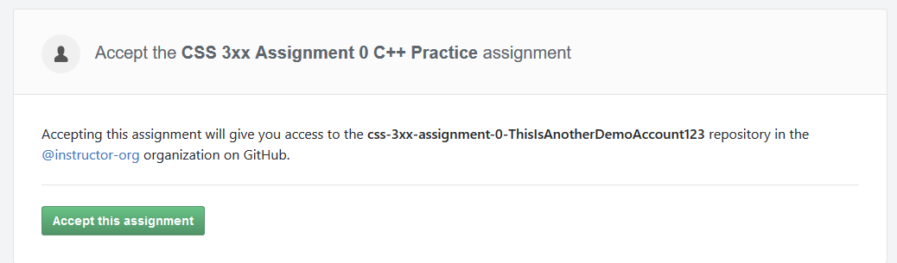
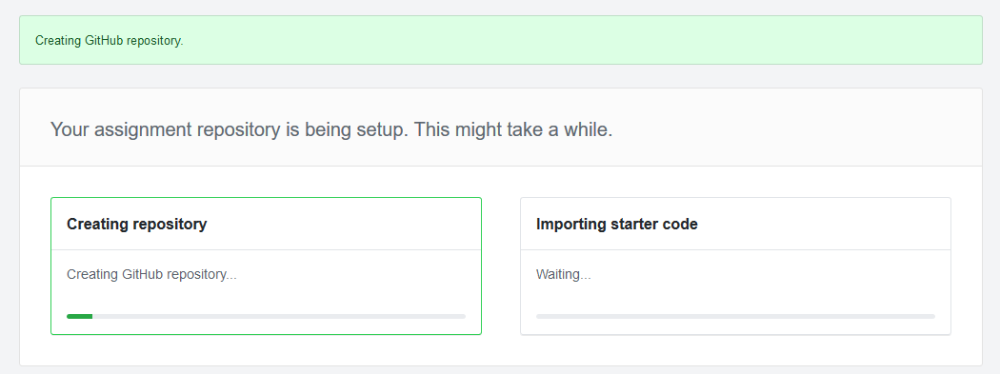
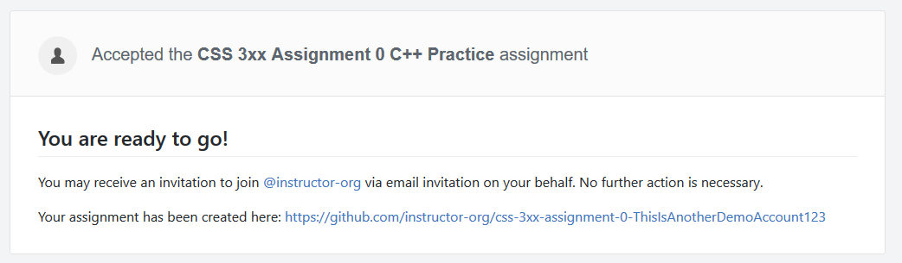
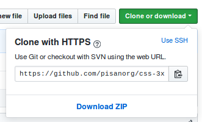

# Initializing a new Repository

A repository is used to contain all of the files for a specific project. Generally,
it's best practice to use one repository per project, and to keep all of the project
files in the same location.

When working on Git projects that will be synced with GitHub, you'll have two copies of the
repo. One will be hosted on GitHub, and another will be on your local machine.
In addition, if you use multiple computers, each will need their own copy of the repo.

## Creating Repos for GitHub Classroom

When you will be creating repos for GitHub classroom, you'll want to follow these steps.

### Step 0. Accept the Assignment

Your instructor will provide you with a link to the assignment. It should look
something like this: `https://classroom.github.com/a/xxxxxxx`. Open that link
in your browser.



Clicking this button will create a new repo for you to work in.
This typically takes a few seconds.



When this is done, you'll see this confirmation page.



### Step 1. Clone the repository

Open the repository link that was created for you by GitHub classroom.
This will be your private repository for working on the assignment.


If your instructor has provided a template for the assignment, you may see
that your repo already contains files. Otherwise, your repo may be empty.

Click on the green _"Clone or download"_ button.



Make sure that this says _"Clone with HTTPS"_. If it doesn't, click the link in the top right of this pop-up.
SSH is only used if you have set up certificates, which is a topic that we will not cover in this document.

Copy the link provided in this popup.

#### Linux and Mac Instructions

Open your terminal application.

Type the follwing to navigate to your home directory: `cd ~`.

Then, create a folder called _"Git"_ under this directory: `mkdir Git`.
This will be used to store all of your Git projects.

Navigate into this directory with: `cd Git`

You can then clone your project using: `git clone https://github.com/instructororg/yourrepohere.git`
with the link from your GitHub repository.

You will be asked for your GitHub username and password. When typing in your password, you will not see
any indicators for your password, so just hit Enter/Return when you are done.

Then, using the command `ls`, you should see a new directory for your assignment in this directory.
`cd directoryName` to it, and you should see your files there.

#### Windows Instructions

Create a new folder with the name _"Git"_, under your `C:\` drive.

Open _Command Prompt_. Use the following command to navigate to that folder: `cd C:\Git`.

You can then clone your project using: `git clone https://github.com/instructororg/yourrepohere.git`
with the link from your GitHub repository.

You will be asked for your GitHub username and password. When typing in your password, you will not see
any indicators for your password, so just hit Enter/Return when you are done.

Then, open the folder `C:\Git` under File Explorer, and your files should be there.

## Creating your own repos

If you aren't using GitHub classroom, then you'll want to follow these steps.

### Step 0. Create your `Git` folder.

We recommend creating a folder in an easily-accessible location in your file system for storing your Git repos.
On Windows `C:\Git` and on Linux or Mac `~/Git` are good options.

Navigate to this directory in your command line with `cd C:\Git` or `cd ~/Git`.

### Step 1. Create a repo on GitHub

Navigate to [github.com/new](https://github.com/new), or use the green _"New Repository"_ button on your GitHub home page.


Then, fill out some the repo settings.

**Note** If you already have files, it's a lot easier if you do not create a README, add a .gitignore or a license. You can always do these later.


## Step 2. Setup an existing repo, or create a new one

Once your repository is created, you should see this screen:


### If you already have project files

Navigate to the directory that contains your project.
Initialize a new git repository in that directory with `git init`.
We'll then want to configure our repository to know where it should sync code.
Copy the `HTTPS` url from the page on GitHub, and paste it as an argument to the `git remote add origin` command.

Then, we'll want to commit all of the files in this directory, and push them to GitHub.

```console
git init
git remote add origin https://github.com/xxxxxxxxx/xxxxxx.git
git add .
git commit -m "initial commit"
git push -u origin master
```

If all these commands ran without errors, if you refresh your repo page it should contain the project files.

### If you don't have any project files

If we do not yet have any project files, we can use the instructions from GitHub to populate our repo with a placeholder
README.
This creates a new file, commits it, sets the remove (server) url, and pushes the new master branch to it.

```
echo "# ideal-chainsaw" >> README.md
git init
git add README.md
git commit -m "first commit"
git remote add origin https://github.com/ThisIsAnotherDemoAccount123/ideal-chainsaw.git
git push -u origin master
```

## Setting the remote URL

To set the remote URL, first copy the URL link of the GitHub repository you're tyring to sync to. This can be done by navigating to your repository page on GitHub. Once you're there, click the `Clone or download` button found under the repository details. Example:


Then, copy the link. In the above example it would be `https://github.com/pisanorg/Student-Git-Docs.git`.

After you have copied the link, run the following command:

```console
git remote set-url origin https://github.com/pisanorg/Student-Git-Docs.git
```

To verify that the command worked, run `git remote -v`. In the above example, it would look something like this


## Pushing the current branch to GitHub

After setting the remote URL, you can push your current branch (if you have write-access to the GitHub repository you're hoping to push to) to GitHub by running:

```console
git push -u origin BRANCH_NAME_GOES_HERE
```

You can verify if this command worked by navigating to your repository's webpage. You should see your branch listed in the branch list.

**NOTE** If you want to push new commits to the GitHub repository after you have ran the above command, run `git push`.
