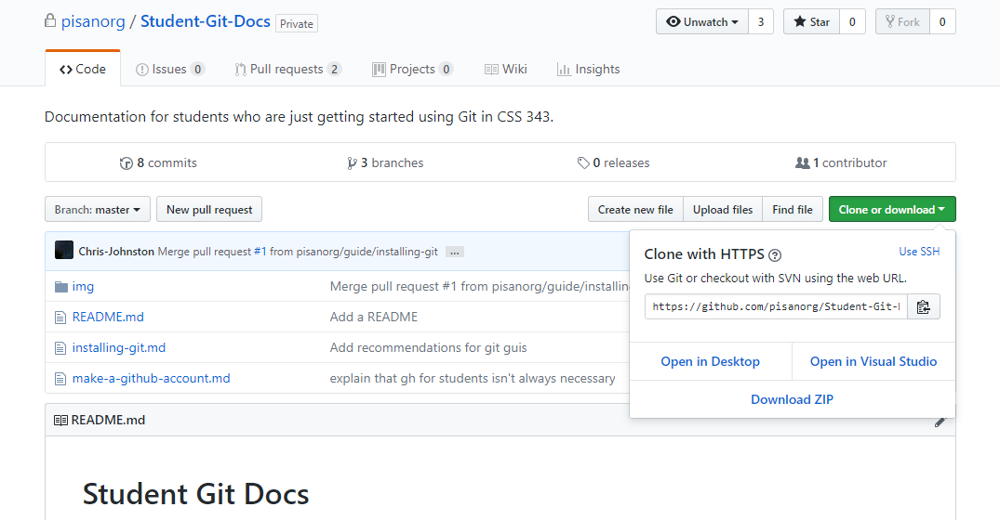
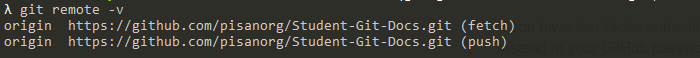

# Syncing your local repository to GitHub

## Setting the remote URL

To set the remote URL, first copy the URL link of the GitHub repository you're tyring to sync to. This can be done by navigating to your repository page on GitHub. Once you're there, click the `Clone or download` button found under the repository details. Example:



Then, copy the link. In the above example it would be `https://github.com/pisanorg/Student-Git-Docs.git`.

After you have copied the link, run the following command:

```
  git remote set-url origin [PASTE_LINK_HERE]
```

To verify that the command worked, run `git remote -v`. In the above example, it would look something like this



## Pushing the current branch to GitHub

After setting the remote URL, you can push your current branch (if you have write-access to the GitHub repository you're hoping to push to) to GitHub by running:

```
  git push origin -u https://github.com/pisanorg/Student-Git-Docs.git
```

You can verify if this command worked by navigating to your repository's webpage. You should see your branch listed in the branch list.

## Pulling changes from GitHub

To pull any changes from the GitHub branch to your local repository simply run `git pull`.

**NOTE** You might run into merge conflicts if you committed changes to your local repository before it's fully synced with the GitHub repository. We will not be covering how to deal with merge conflicts in this tutorial. 

[Learn more about how to resolve merge conflicts here](https://help.github.com/articles/resolving-a-merge-conflict-using-the-command-line/).