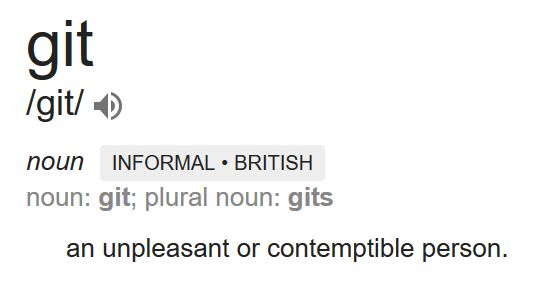

# What is Git?

Git is a version control system. Version control systems track the set of changes applied to files, and allow for
users to switch between versions of these files. It also allows for the distribution of files, which
enables teams to work in sync with each other.

TODO

## Who uses Git?

Tons of individuals and organizations use Git.

- Amazon, Microsoft, Facebok, Netflix, Linux, Android, Eclipse, Starbucks, Google...
- Over 31 million users on GitHub (note: Git != GitHub)
- Your classmates!

## Why use Git?

As with any version control system, git offers some nice features:

- Lets you keep your files in sync.
    - Works across workstations, like your laptop and desktop
    - Works across teams, each member can get the latest changes

- Backs up your source code.

    Because your files can be backed up to GitHub or some other host, you have much less risk of losing
    your files due to hardware failures.

- Enables for distributed collaboration.

    Multiple team members can work remotely on the same set of files, no matter their location.

- Manage complex workflows.

    Git enables teams of any size to contribute to projects, all at the same time.

- Tracks your revision history.

    You can rollback changes to any state at any time.
    This is great for working on features or breaking changes, while
    maintaining a stable copy of the project at the same time.

## What isn't Git?

**Git is not GitHub:** Git is the version control tool that tracks files.
Git can connect to GitHub to download files and push changes.
Git runs independent of any online service, and doesn't even need to connect online.

GitHub is a website that host repositories. They also add features that enhance open-source software workflows.
Adds support for Issues, Pull Requests, and continuous integration.

Common alternatives to GitHub are GitLab, BitBucket, etc. Git can work with these interchangeably just fine.

**Git is not Google Drive/Dropbox/etc.:**
While Git does allow for real-time collaboration on projects, it does not allow for simultaneous changes by multiple
authors. Instead, batches of changes are made by individual authors which then are merged into the overall codebase.
Don't expect functionality like Google Docs.

