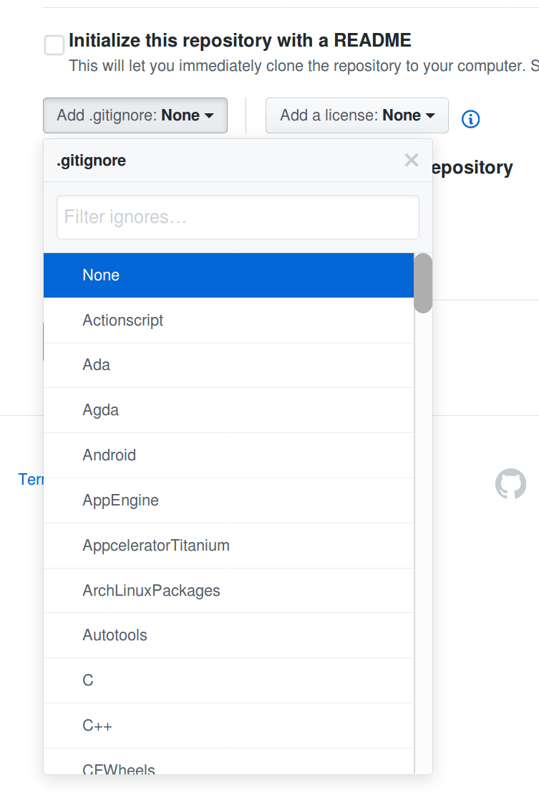

# .gitignore Files

`.gitignore` is a metadata file used by Git. You can use it to specify a pattern
for ignoring certain files from being committed to your repository.

## Why do I need one?

For most projects, you'll typically end up compiling some sort of output,
like binaries or executables.
It's strongly recommended that you *do not* include these in your
repository, as this can greatly increase the size of your repository.

In addition you can use these files to prevent accidentally committing
configuration variables, like tokens and other secrets.
If you are working with IDEs like Visual Studio or IntelliJ, they will often
include some metadata files that are not recommended to include in your source
code, as they change often and may not be relevant to your project.

Instead, it's recommended to include instructions for how to build your project.
If you are using Continuous Integration, you can even run automated builds
each time you push a new commit.

## What do they do?

When you run `git status`, it'll show you a list of all the files that
have been added, removed, or changed.
If you are working in C++, you may end up with some `a.out` files
after you compile your source code.

Using a `.gitignore` file, you can specify a pattern to ignore these files.
This way, they won't show up under `git status`.

## How do I make one by hand?

[The official Git documentation explains in full how these files are made.](https://git-scm.com/docs/gitignore)

Simply create a new file in your repository called `.gitignore`. By convention, this value will be hidden on Unix systems, since they start with `.`.
You can view hidden files using `ls -l`.

In your `.gitignore` file, add the following:

```
# comments start with #
# you can specify file names to exclude explicitly, like 'a.out'
a.out
# you can also use pattern matching
*.o
```

## Where can I find `.gitignore`s to use?

It's important to understand how `.gitignore` files work, so that you
can modify these if you have any issues.
Generally, most languages and environments will have pre-made `.gitignore` files
that you can use. These typically exclude all the files that you should,
like environment-specific configuration, secrets, or build artifacts.

[This repository contains many pre-made `.gitignore` files that are free to use.](https://github.com/github/gitignore/)

If you are using GitHub and creating a new repository,
you can also include one of these `.gitignore` files as part of your initial files.


