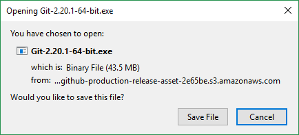
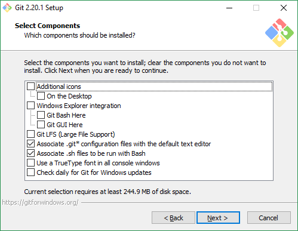
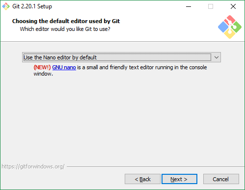
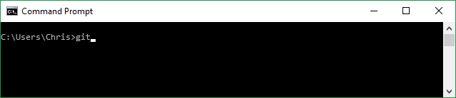

# Installing Git

This guide lists some of the options that there are for installing git.
Traditionally, Git is a command-line application, but there are many 
front-end GUIs for it that may make it easier to use.

For the most part, most guides will assume you are using the command line,
as it is most fully-featured and supported.

## Command Line

### Windows

[You can find the download link on the official website.](https://git-scm.com/downloads)



1. First, download the installer file. You'll most likely want the latest 64-bit version.

2. Run the installer file. You'll likely need local Administrator permissions.

3. Accept the license and hit Next.



4. Select which components you would like to install. Typically the defaults are OK. Hit next.



5. **Important!** Select your default editor. By default this is set to Vim. Unless you are already 
familiar with Vim, we recommend that you choose **Nano**.

6. Say that you would like to use "Git from the command line and also from 3rd-party software", which
is the default option, then hit next.

7. Select that you would like to "Use the OpenSSL library", which is
the default option, and hit next.

8. Select that you would like to "Checkout Windows-style, commit Unix-style line endings",
which is the default option and recommended for Windows. Hit next.

9. Select either terminal emulator you prefer. If you are unsure, stick to the default settings,
and hit next.

10. Use the default options under "extra options", leave "Enable file system caching" and
"Enable Git Credential Manager" checked. Hit next.

11. Wait for the installation to finish. This process should take less than a minute.

12. Close the installer, if there are no errors. If you encounter an error, your best option
would be to search the web for the error message.

13. Open Command Prompt, by typing `cmd` in the Start Menu, and pressing Enter.



14. Verify that the installation finished without errors by typing `git` and pressing Enter.
You should see the help command.

If you see the text `'git' is not recognized as an internal or external command,
operable program or batch file.`, it means that something didn't work properly.

Follow these troubleshooting steps:

1. Restart a new instance of `cmd`, and try again.
2. Log out, log in, and try again.
3. Re-install Git, and try again.

### Mac OS

[You can find the download link on the official website.](https://git-scm.com/downloads)

installation instructions TODO, until we can find someone with a mac to write them for us

TODO - apparently you can also just type `git --version` in the Terminal, and if it is not installed
then it will try to install it for you. https://git-scm.com/book/en/v2/Getting-Started-Installing-Git

### Linux

For Ubuntu/Linux Mint/Debian-based systems, you can simply install `git` using your
package manager. You may need to run with `sudo`.

**This will not work on the lab machines!**

```console
sudo apt install git
```

[For other distributions, refer to the Git documentation.](https://git-scm.com/download/linux)