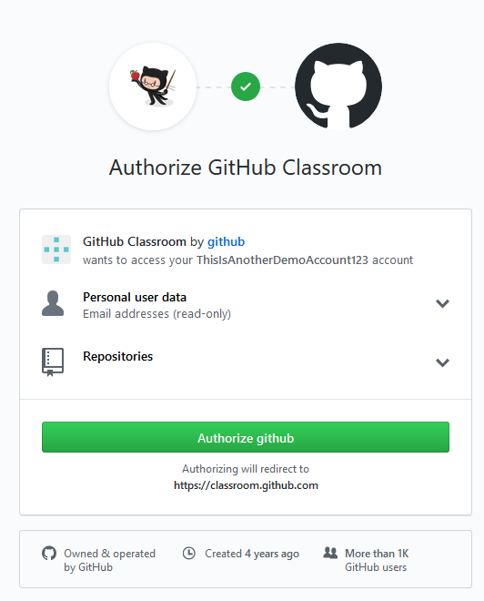

# Making a GitHub Account for GitHub Student

This guide walks through the process for creating a GitHub account
for students who will be using GitHub student.

## Creating a GitHub Account

1. Navigate to [github.com/join](https://github.com/join)

2. Fill in the details of the sign-up form.

    - Try to pick a professional username.
    - You may want to use your personal e-mail address instead of your school one, just so that you retain access to it.
    - As with anything, be sure to choose a secure password.

3. Choose the "Free Tier" plan. Don't tick the checkboxes at the bottom for setting up an
organization.

4. You can choose to fill out the survey in the 3rd step, but you can skip this at the bottom.

5. Check your email. You'll recieve an email asking you to verify your account,
which is required to move on.

Great, now we have our brand-new GitHub account (with a registered email).
What's next?

## Authorizing GitHub Classroom

If your instructor already has an assignment created in GitHub classroom,
they should have sent you a link. It'll look something like this:
`https://classroom.github.com/a/xxxxxxx`

Open this link and you'll see this (unless you have done this already).

You'll want to "Authorize" GitHub Classroom to have access to your profile.

Depending on the class configuration, you may see this page next. If you don't, just move on to the next step.

If you have not already joined the classroom roster, select the identifier
that corresponds to you. While the example shows student ID numbers, this
could also be your name or net ID.

Finally, you'll see this page where you can accept the assigment.

Clicking this button will create a new repo for you to work in.
This typically takes a few seconds.

When this is done, you'll see this confirmation page.

TODO Joining assignments is covered in another document.

## (Optional, but recommended) GitHub Student Pack Benefits

A huge benefit to being a student (with a working `.edu` email address)
is having access to student perks.
GitHub partners with many other companies to provide a "student pack",
of free trials and discounts for students.

GitHub gives students access to unlimited private repos at no cost.
While you do not need these for assignments using GitHub Classroom, it's nice
to have for personal projects or other assignments.

**Edit:** [As of 1/7/2019, GitHub now offers unlimited free repos, but limited to up to 3 collaborators. You should still sign up for the educational discount if you plan to work in groups larger than 3.](https://blog.github.com/changelog/2019-01-08-pricing-changes/)

**Unless you have permission, never post your homework solutions in a public repo.**

1. First, navigate to [education.github.com/pack](https://education.github.com/pack).

2. Click _"Get your Pack"_, and _"Yes, I'm a student"_ (because you are).

TODO we need to write those docs for professors too aarggh

3. Fill out this form. You'll definitely want to use your UW-issued e-mail address.

You should eventually hear back from GitHub support.