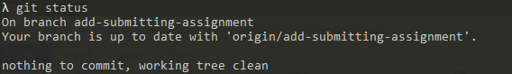
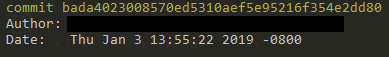

# Submitting Individual Assignments <!-- omit in toc -->

## Table of Contents <!-- omit in toc -->

- [Preparing your repository](#preparing-your-repository)
- [Submitting your assignment](#submitting-your-assignment)
- [Walkthrough](#walkthrough)
  - [Commit all of your changes and push to GitHub](#commit-all-of-your-changes-and-push-to-github)
  - [Copy the hash of your last commit](#copy-the-hash-of-your-last-commit)
  - [Paste the name of your last commit on Canvas](#paste-the-name-of-your-last-commit-on-canvas)
- [Submitting Group Assignments](#submitting-group-assignments)

This guide will walk you through how to submit each of your assignments.

**NOTE** Pushing any new commits after the submission deadline is allowed, but will show up as a late submission and suffer any late penalties specifcied by the instructor's syllabus.

## Preparing your repository

Your repository should be well documented and be able to compile and run before you submit your assignment.

## Submitting your assignment

To submit your assignment, simply determine the name of your last commit (using `git log`) and submit it as a plaintext via canvas. If you have pushed any new commits **before the submission deadline**, you should re-submit the assignment on canvas with the latest commit. 

## Walkthrough

### Commit all of your changes and push to GitHub

Make sure all of your changes have been committed and pushed to GitHub. You can double-check this by running `git status`, which should look something similar to this:



### Copy the hash of your last commit

After you have verified that all of your changes have been pushed, copy the hash of the last commit. You can do this by running `git log` and copying the hash of the latest commit in the list. For example, if I run `git log`:



Then I would copy `bada4023008570ed5310aef5e95216f354e2dd80`.

Alternatively, running `git rev-parse HEAD` will also yield the hash of the last commit.

### Paste the name of your last commit on Canvas

Login to canvas, and navigate to your course's homepage. From there, navigate to the assignment page and click `Submit Assignment`. Then, paste the hash of your last commit (which would be `bada4023008570ed5310aef5e95216f354e2dd80`, in my case) into the submission details of your assignment. Then click `Submit`.

## Submitting Group Assignments

Submitting group assignments follow the same instructions as the above individual assignments, but be sure to include your group name and everyone's name in the submission details. Example layout:

```
Latest Commit: bada4023008570ed5310aef5e95216f354e2dd80
Group Name: The Bears
Group Members:
  - Name #1
  - Name #2
  - Name #3
```