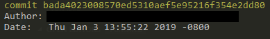

# Submitting Individual Assignments

This guide will walk you through how to submit each of your assignments.

**NOTE** Pushing any new commits after the submission deadline is not allowed.

## Preparing your repository

Your repository should be well documented and be able to compile and run before you submit your assignment. Any commented out and/or uneeded code should be deleted before submission

## Submitting your assignment

To submit your assignment, simply determine the name of your last commit (using `git log`) and submit it as a plaintext via canvas. If you have pushed any new commits **before the submission deadline**, you should re-submit the assignment on canvas with the latest commit. 

## Walkthrough

### Commit all of your changes and push to GitHub

Make sure all of your changes have been committed and pushed to GitHub. You can double-check this by running `git status`, which should look something similar to this:

### Copy the name of your last commit

After you have verified that all of your changes have been pushed, copy the name of the last commit. You can do this by running `git log` and copying the name of the latest commit in the list. For example, if I run `git log`:

Then I would copy `bada4023008570ed5310aef5e95216f354e2dd80`.

### Paste the name of your last commit on Canvas

Login to canvas, and navigate to your course's homepage. From there, navigate to the assignment page and click `Submit Assignment`. Then, paste the name of your last commit (which would be `bada4023008570ed5310aef5e95216f354e2dd80`, in my case) into the submission details of your assignment. Then click `Submit`.